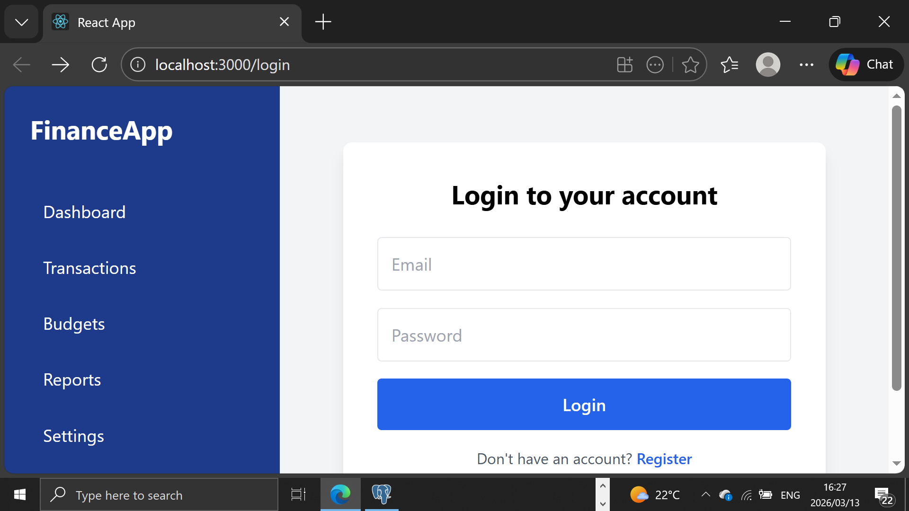
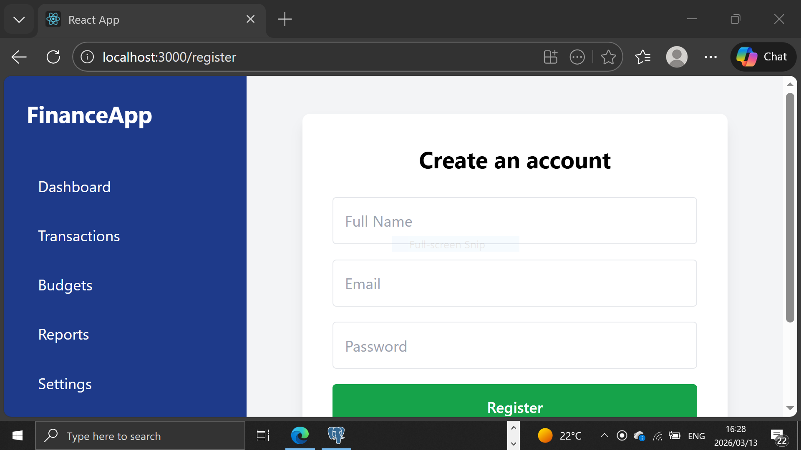
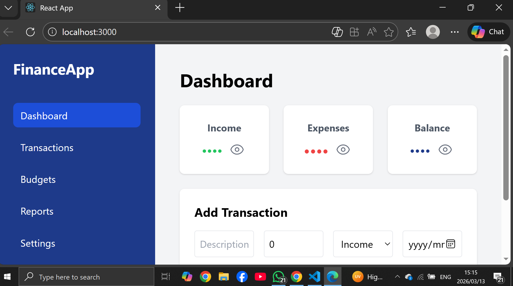
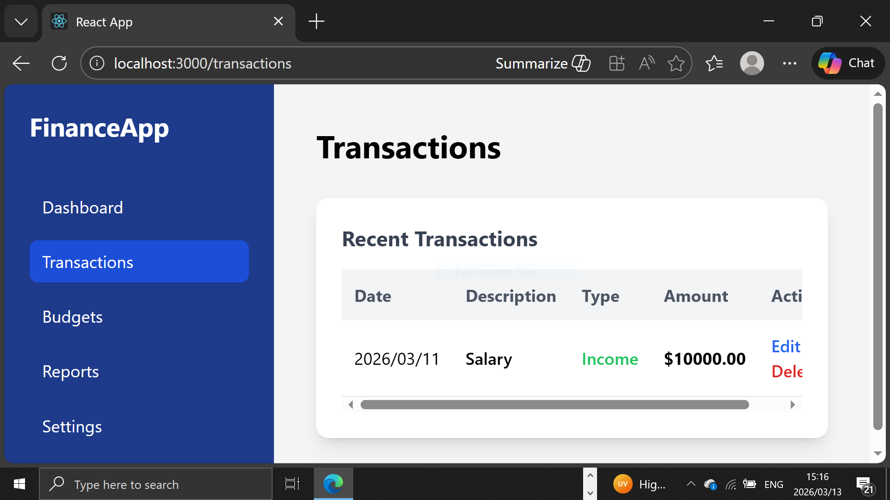
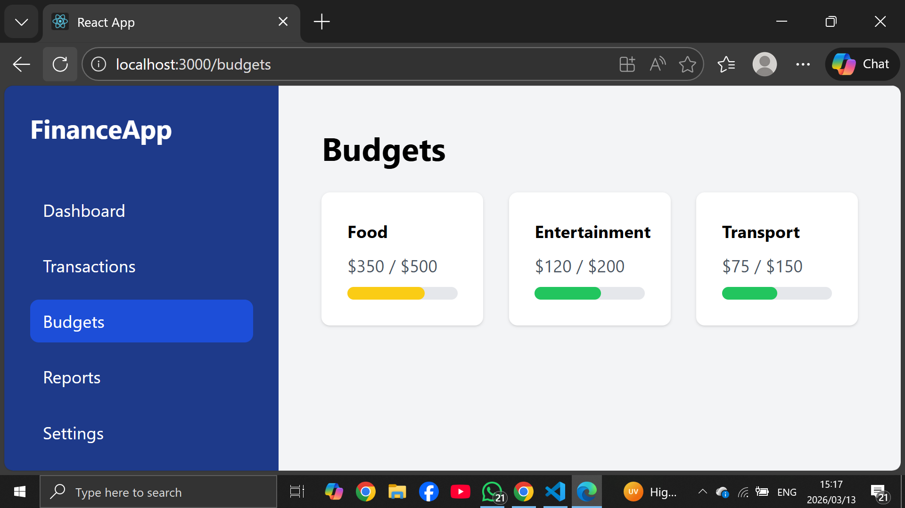
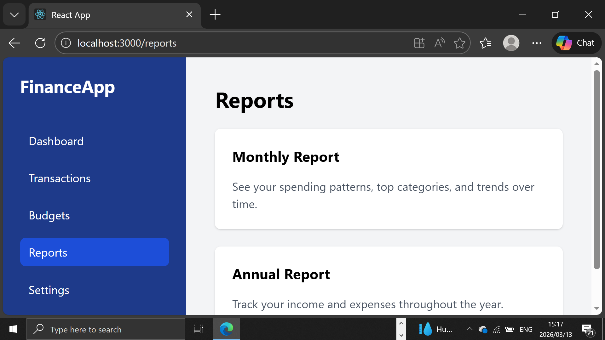

# Personal Finance Dashboard 💰

Hi! This is my **Personal Finance Dashboard** project. I built this app to help users manage their money effectively by tracking **income, expenses, and balances** in a modern and interactive interface.  

I created this project as part of my learning journey in **React, TypeScript, TailwindCSS, Node.js, and PostgreSQL**, and to practice building full-stack applications with real-time features.

---

## Features 📝
- **Authentication:** Login and Registration system with protected routes.
- **Dashboard Overview:** Shows Income, Expenses, and Balance with a privacy toggle (eye icon).  
- **Transactions Management:** Add, edit, delete transactions with real-time updates.  
- **Page Navigation:** Separate pages for Dashboard, Transactions, Budgets, Reports, and Settings.  
- **Modern UI & Animations:** Smooth transitions and responsive design using TailwindCSS and Framer Motion.  
- **Backend:** Node.js + Express API with PostgreSQL database.  

## Screenshots 📸

### Login Page

### Register Page

### Dashboard

### Transactions Page

### Budgets Page

### Reports Page

## Tech Stack ⚙️

- **Frontend:** React, TypeScript, TailwindCSS, Framer Motion, Heroicons  
- **Backend:** Node.js, Express  
- **Database:** PostgreSQL  
- **Version Control:** Git & GitHub  

## Installation 🚀

1. Clone the repository:

***bash
git clone https://github.com/yourusername/personal-finance-dashboard.git

2. Navigate to the frontend and install dependencies:

***bash
cd personal-finance-dashboard/frontend
npm install

3. Navigate to the backend and install dependencies:

***bash
cd ../backend
npm install

4. Start the backend server:

***bash
npm run dev

5. Start the frontend server:

***bash
cd ../frontend
npm start

6. Open the application in your browser:

http://localhost:3000

## Usage
    
    •   Add transactions on the Transactions page.
	•	Toggle visibility of financial data on the Dashboard using the eye icon.
	•	View summaries and financial insights on the Reports page.
	•	Set and manage budgets on the Budgets page.
	•	Adjust preferences and account options in Settings.
	•	Login or register to access your personal dashboard.

## Contribution

If you'd like to improve this project:

1. Fork the repository
2. Create a new branch

***bash
git checkout -b feature-name

3. Commit your changes
***bash
git commit -m "Add new feature"

4. Push to your branch

***bash
git push origin feature-name

5. Open a Pull Request

## Author

Made with ❤️ by **Arnold Ndlovu**

GitHub:  
https://github.com/Arnold0783
